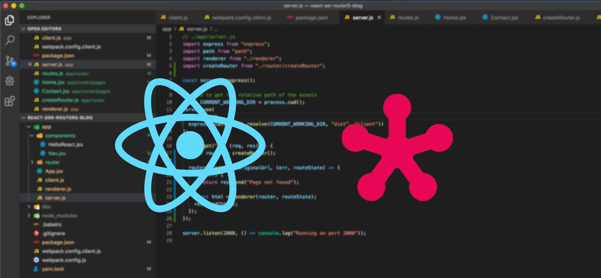

# Universal React app with Router5

This repository has a simple version of a React application running on Server-Side, and uses Router5 to handle the navigation between pages.



## Architecture:

- [React](https://reactjs.org/)
- [Express](https://expressjs.com)
- [Webpack](https://webpack.js.org/)
- [Babel](https://babeljs.io)
- [Router5](https://router5.js.org/)

## Set up:

To run this project:

```
$ cd universal-react-router5
$ yarn build
$ node dist/server.bundle.js
```

The server will start up on port 2000.
